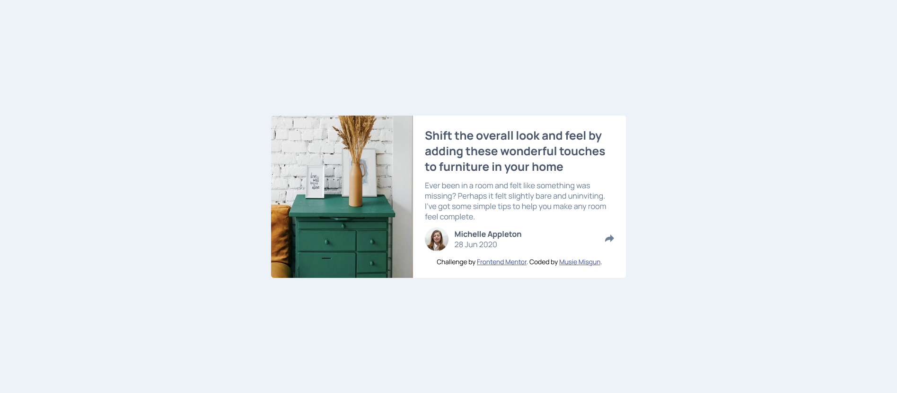
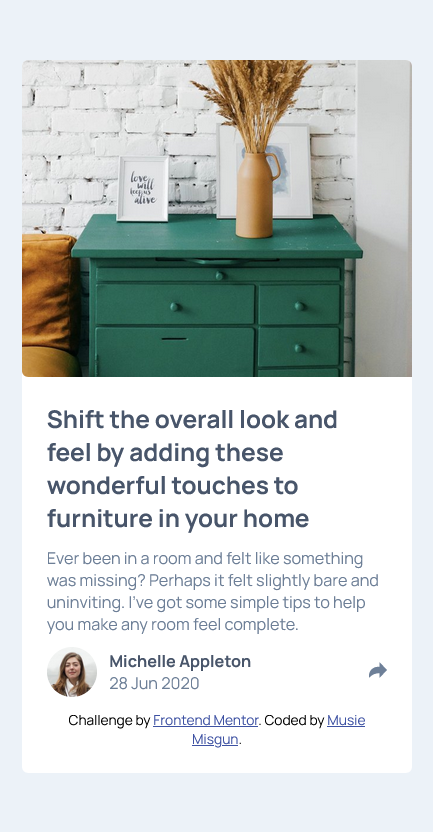
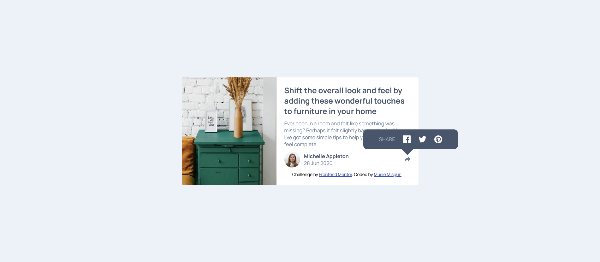
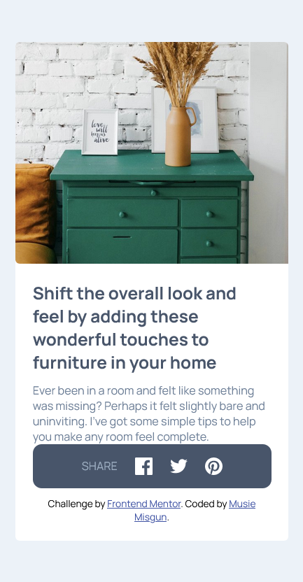

# Frontend Mentor - Article preview component solution

This is a solution to the [Article preview component challenge on Frontend Mentor](https://www.frontendmentor.io/challenges/article-preview-component-dYBN_pYFT). Frontend Mentor challenges help you improve your coding skills by building realistic projects.

## Table of contents

- [Overview](#overview)
  - [The challenge](#the-challenge)
  - [Screenshot](#screenshot)
  - [Links](#links)
- [My process](#my-process)
  - [Built with](#built-with)
  - [What I learned](#what-i-learned)
  - [Continued development](#continued-development)
- [Author](#author)

**Note: Delete this note and update the table of contents based on what sections you keep.**

## Overview

### The challenge

Users should be able to:

- View the optimal layout for the component depending on their device's screen size
- See the social media share links when they click the share icon

### Screenshot






### Links

- Solution URL: [Add solution URL here](https://your-solution-url.com)
- Live Site URL: [Add live site URL here](https://your-live-site-url.com)

## My process

### Built with

- Semantic HTML5 markup
- CSS custom properties
- Flexbox
- CSS Grid
- JavaScript

### What I learned

Use this section to recap over some of your major learnings while working through this project. Writing these out and providing code samples of areas you want to highlight is a great way to reinforce your own knowledge.

To see how you can add code snippets, see below:

I used the class "shareparent" as the relative parent to the absolute class "sharebar" to have a perfect share component appear in the desktop version and in the mobile version I used the class "sharewrapper" the relative position.

```html
<div class="sharewrapper marginb">
  <div class="profile">
    
    <div>
      <strong>Michelle Appleton</strong>
      <p>28 Jun 2020</p>
    </div>
  </div>

  <div class="shareparent">
    <div class="sharebar" style="display: none">
      <span>SHARE</span>
      
      
      
    </div>
    <div class="box" style="display: none"></div>
    
  </div>
</div>
```

```css
.shareparent {
  position: relative;
}
.box {
  position: absolute;
  width: 30px;
  height: 30px;
  right: -50%;
  bottom: 150%;
  transform: translate(50%, 0);
  transform: rotate(45deg);
  background-color: hsl(217, 19%, 35%);
}
.sharebar {
  color: white;
  width: 240px;
  height: 50px;
  display: flex;
  justify-content: center;
  align-items: center;
  position: absolute;
  background-color: hsl(217, 19%, 35%);
  bottom: 200%;
  right: 0;
  transform: translate(50%, 0);
  border-radius: 10px;
  z-index: 10;
}
```

```js
//setting an event listerner to status
status.addEventListener("click", (e) => {
  if (sharebar.style.display === "flex") {
    //hide the sharebar and the box
    sharebar.style.display = "none";
    box.style.display = "none";
  } else {
    // Show the sharebar and the box
    sharebar.style.display = "flex";
    if (window.innerWidth > 600) {
      box.style.display = "flex";
    }
  }
});
```

### Continued development

In the future I would like to improve to reduce and make my javascript code efficient. I would also like to refine namings to classes and id.

## Author

- Website - [Musie Misgun](https://sparkling-taffy-9985b2.netlify.app/)
- Frontend Mentor - [@Natty-tech](https://www.frontendmentor.io/profile/Natty-tech)
